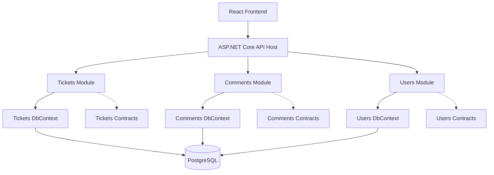

# Nylos Helpdesk

A modern internal helpdesk and issue-tracking platform designed to help teams organize, assign, track, and resolve support issues through a clear and structured workflow.

Nylos Helpdesk provides a centralized workspace where team members can create and manage tickets, assign work to responsible users, monitor ticket progress, and collaborate through ticket discussions. The platform combines a responsive React dashboard with a modular ASP.NET Core backend to provide a maintainable foundation for team support operations.

## Features

### 🔐 Authentication & Security
- **JWT Authentication:** Secure user authentication using short-lived access tokens and HTTP-only refresh tokens.
- **Role & User Context:** Protected API endpoints with server-side token verification and identity context resolution.
- **Client-Side Validation:** Login and form validation with clear user-facing error messages.
- **Responsive Authentication UI:** Modern, responsive split-screen login and signup pages enhanced with Framer Motion animations and client-side form validation.

### 🎟️ Ticket & Workflow Management
- **Full Ticket CRUD:** Create, view, edit, and delete support tickets.
- **User Assignment:** Assign tickets to registered team members and update assignees.
- **Strict Server-Side Status Workflow:** The API enforces valid ticket transitions:
  - `Open` ➔ `In Progress` ➔ `Resolved` ➔ `Closed`
  - Prevents invalid transitions, including moving directly from `Open` to `Closed`.
  - Prevents updates that violate terminal-status workflow rules.
- **Ticket Details:** View ticket information, assignee, priority, status, timestamps, and discussion history.
- **Responsive Ticket Interface:** Status badges, tooltips, responsive ticket tables, and mobile-friendly detail views.

### 🔍 Filtering, Sorting & Pagination
- **Server-Side Pagination:** Ticket lists use paginated API responses for efficient data loading.
- **Ticket Filtering:** Filter by status, priority, and assignee.
- **Dynamic Sorting:** Sort tickets by creation date, updated date, and priority.

### 💬 Comments & Discussion
- **Comment System:** Add and view time-stamped comments attached to specific tickets.
- **Comment History:** View the full discussion thread within ticket details.
- **User Attribution and Ownership:** Each comment is linked to its author.

### ⚙️ Backend Architecture & Engineering (.NET 10)
- **Pragmatic Layered Modular Monolith Architecture:** Separate modules for users, tickets, comments, and shared infrastructure.
- **Global Exception Handling:** Centralized handling of unhandled exceptions with consistent RFC 7807 Problem Details error responses.
- **FluentValidation:** Strongly typed DTO validation before requests reach endpoint logic.
- **EF Core & PostgreSQL:** Relational database design using Entity Framework Core, PostgreSQL, migrations, and primary/foreign-key constraints.
- **EF Core Migrations:** Database schema changes are versioned through EF Core migrations and applied using `dotnet ef database update`.
- **Automatic Default Admin Seeding:** On application startup, the API runs a seed initializer that creates the default administrator account only when it is absent, preventing duplicate seed users after application restarts.
- **OpenAPI Documentation:** API endpoints are exposed as an OpenAPI JSON document in the development environment at [`http://localhost:5231/openapi/v1.json`](http://localhost:5231/openapi/v1.json).

### 🎨 Frontend Quality & User Experience

- **TanStack Query:** Manages server state for tickets, comments, and users through caching, background refetching, mutation handling, and cache invalidation.

- **Form handling:** Forms use `react-hook-form` with `zod` schemas for client-side validation aligned with backend validation rules.

- **Complete UI states:** The application handles loading, empty, filtered-empty, validation, and API-error states throughout the interface.

- **Responsive design:** The UI is designed to work across desktop and smaller mobile screen sizes.

- **Centralized Axios client:** The frontend uses a shared Axios client configured with the API base URL from `VITE_API_BASE_URL`, JSON request headers, a 10-second timeout, and `withCredentials: true`.

- **Cookie-based authentication:** Authentication cookies are sent automatically by the browser with API requests. The frontend does not read, store, or attach authentication tokens manually.

- **Centralized error handling:** The shared Axios client provides consistent handling for API failures, allowing pages and components to display predictable validation and error feedback.

> **Security note:** Authentication cookies use the `HttpOnly` flag, so they cannot be accessed through JavaScript or `document.cookie`. For cross-origin frontend/API requests, `withCredentials: true` instructs the browser to include cookies. The backend must also allow credentials through its CORS policy and use an explicit allowed origin rather than `*`. [278][279][280]
```ts
const apiClient = axios.create({
  baseURL: import.meta.env.VITE_API_BASE_URL,
  headers: {
    "Content-Type": "application/json",
  },
  withCredentials: true,
  timeout: 10_000,
});
```

## Database Setup

The database schema is managed through Entity Framework Core migrations.

### Create a migration

Run this command after changing an entity, EF Core configuration, relationship, column, enum mapping, or seed-data configuration:

```bash
dotnet ef migrations add StoreUserRoleAsString \
  --project src/Modules/Users/Nylos.Helpdesk.Modules.Users \
  --startup-project src/Host/Nylos.Helpdesk.Api \
  --context UsersDbContext \
  --output-dir Infrastructure/Persistence/Migrations
```

### Apply migrations

Run this command to create or update the PostgreSQL database to the latest migration:

```bash
dotnet ef database update \
  --project src/Modules/Users/Nylos.Helpdesk.Modules.Users \
  --startup-project src/Host/Nylos.Helpdesk.Api \
  --context UsersDbContext
```

### Default administrator account

When the API starts, it automatically creates the default administrator account if it does not already exist:

| Field | Value |
|---|---|
| Email | `admin@nylos.com` |
| Password | `Admin@123456` |

> This account is intended for local development and assessment testing only.

## Technology Stack

### Backend
- **C# (.NET 10)**
- **ASP.NET Core Web API**
- **Entity Framework Core **
- **Npgsql PostgreSQL provider**
- **PostgreSQL**
- **JWT Authentication:** Access and refresh tokens
- **FluentValidation:** Request and DTO validation
- **Custom Global Exception Handling Middleware:** Consistent RFC 7807 Problem Details error responses
- **OpenAPI:** API documentation available in development at [`http://localhost:5231/openapi/v1.json`](http://localhost:5231/openapi/v1.json)

### Frontend
- **React + vite** with **TypeScript**
- **React Router DOM:** Client-side routing
- **TanStack Query (React Query):** Server-state management, caching, and refetching
- **Axios:** HTTP client for API requests
- **Tailwind CSS:** Utility-first styling
- **React Hook Form:** Form state management
- **Zod:** Client-side schema validation
- **Framer Motion:** UI animations and transitions
- **Lucide React:** Icon library

### Development Tools
- **Docker & Docker Compose:** Local PostgreSQL database container setup
- **Entity Framework Core CLI:** Database migrations and updates
- **Git & GitHub:** Version control and repository hosting

## Local PostgreSQL

PostgreSQL runs locally through Docker Compose.

### Start the database

```bash
cd backend
cp .env.example .env
docker compose up -d
```

### Check database status

```bash
docker compose ps
```

### Stop the database

```bash
docker compose down
```

### Remove the database and all local data

> Warning: this permanently deletes local PostgreSQL data.

```bash
docker compose down -v
```

## Architecture

The backend follows a pragmatic layered modular monolith architecture.

The application is developed as one ASP.NET Core API, but the code is divided into three business modules:

- Tickets
- Comments
- Users

Each module owns its:

- Domain rules.
- Application use cases.
- Presentation endpoints.
- EF Core `DbContext`.
- PostgreSQL schema.
- Database migrations.

Modules communicate through explicit contracts rather than directly accessing another module's implementation or database context.

```text
React frontend
      ↓
ASP.NET Core API host
      ↓
Tickets | Comments | Users modules
      ↓
PostgreSQL
```

## Backend structure

```text
backend/
├── Nylos.Helpdesk.slnx
├── docker-compose.yml
├── src/
│   ├── Host/
│   │   └── Nylos.Helpdesk.Api/
│   │       ├── Program.cs
│   │       ├── Controllers/
│   │       ├── Middleware/
│   │       └── appsettings.json
│   │
│   ├── Modules/
│   │   ├── Tickets/
│   │   │   ├── Nylos.Helpdesk.Modules.Tickets/
│   │   │   │   ├── Application/
│   │   │   │   ├── Domain/
│   │   │   │   ├── Infrastructure/
│   │   │   │   │   ├── Persistence/
│   │   │   │   │   └── Migrations/
│   │   │   │   ├── Presentation/
│   │   │   │   └── TicketsModule.cs
│   │   │   └── Nylos.Helpdesk.Modules.Tickets.Contracts/
│   │   │
│   │   ├── Comments/
│   │   │   ├── Nylos.Helpdesk.Modules.Comments/
│   │   │   │   ├── Application/
│   │   │   │   ├── Domain/
│   │   │   │   ├── Infrastructure/
│   │   │   │   ├── Presentation/
│   │   │   │   └── CommentsModule.cs
│   │   │   └── Nylos.Helpdesk.Modules.Comments.Contracts/
│   │   │
│   │   └── Users/
│   │       ├── Nylos.Helpdesk.Modules.Users/
│   │       │   ├── Application/
│   │       │   ├── Domain/
│   │       │   ├── Infrastructure/
│   │       │   ├── Presentation/
│   │       │   └── UsersModule.cs
│   │       └── Nylos.Helpdesk.Modules.Users.Contracts/
│   │
│   └── Shared/
│       ├── Nylos.Helpdesk.Shared.Abstractions/
│       └── Nylos.Helpdesk.Shared.Infrastructure/
│
└── tests/
```
### Backend responsibilities

- `Host`: Application startup, dependency injection, middleware, and module registration.
- `Tickets`: Ticket CRUD, assignment, filtering, pagination, and status workflow.
- `Comments`: Ticket comment creation and retrieval.
- `Users`: User management and assignee lookup.
- `Contracts`: Public module interfaces and DTOs used for module-to-module communication.
- `Shared.Abstractions`: Small cross-cutting abstractions.
- `Shared.Infrastructure`: Shared technical services such as error handling and observability.

### Module communication rules

Modules are isolated by default.

- A module must not reference another module's implementation project.
- A module may reference another module's `*.Contracts` project when it needs a public interface or shared DTO.
- A module must not access another module's `DbContext` or database tables directly.
- Cross-module references use IDs, such as `AssigneeId`, `TicketId`, and `AuthorId`, rather than EF navigation properties across module boundaries.
- Ticket workflow rules are enforced on the server, not only in the React UI.

### Persistence ownership

Each module owns its own EF Core persistence boundary:

- `TicketsDbContext` → `tickets` schema and migrations.
- `CommentsDbContext` → `comments` schema and migrations.
- `UsersDbContext` → `users` schema and migrations.

All contexts connect to the same PostgreSQL database for local development.
## System overview



## Database design

The application uses PostgreSQL with Entity Framework Core migrations. The database is organized into domain-specific schemas rather than placing all tables in PostgreSQL’s default `public` schema.

Each backend module owns its schema, EF Core `DbContext`, entity configurations, and migrations:

| Module | PostgreSQL schema | DbContext |
|---|---|---|
| Users | `users` | `UsersDbContext` |
| Tickets | `tickets` | `TicketsDbContext` |
| Comments | `comments` | `CommentsDbContext` |

### Users schema

#### `users.users`

Stores registered users, authentication credentials, and authorization roles.

| Field | Description |
|---|---|
| `id` | Primary key (`UUID` / `Guid`) |
| `name` | User display name |
| `email` | Unique email address |
| `password_hash` | Securely hashed password |
| `role` | User role: `Admin` or `User` |
| `created_at` | UTC timestamp when the user was created |

#### `users.refresh_tokens`

Stores refresh-token records used to maintain authenticated sessions and rotate access tokens securely.

| Field | Description |
|---|---|
| `id` | Primary key (`UUID` / `Guid`) |
| `user_id` | Required foreign key to `users.users.id` |
| `token_hash` | Hash of the refresh token; the raw token is not stored |
| `expires_at` | UTC timestamp after which the token is invalid |
| `is_revoked` | Indicates whether the token was revoked or consumed during rotation |
| `created_at` | UTC timestamp when the token was issued |

### Tickets schema

#### `tickets.tickets`

Stores support-ticket details, status workflow state, priority, and user ownership references.

| Field | Description |
|---|---|
| `id` | Primary key (`UUID` / `Guid`) |
| `ticket_number` | Auto-incrementing reference number for users |
| `title` | Short ticket summary |
| `description` | Detailed description of the reported issue |
| `priority` | `Low`, `Medium`, `High`, or `Urgent` |
| `status` | `Open`, `InProgress`, `Resolved`, or `Closed` |
| `assignee_id` | Nullable reference to the user assigned to the ticket |
| `creator_id` | Required reference to the user who created the ticket |
| `created_at` | UTC timestamp when the ticket was created |
| `updated_at` | UTC timestamp when the ticket was last updated |

### Comments schema

#### `comments.comments`

Stores messages in the discussion thread for a ticket.

| Field | Description |
|---|---|
| `id` | Primary key (`UUID` / `Guid`) |
| `content` | Comment message text |
| `ticket_id` | Required reference to `tickets.tickets.id` |
| `user_id` | Required reference to `users.users.id` |
| `created_at` | UTC timestamp when the comment was created |

### Entity relationships

```text
users.users (1) ──────────────── (*) users.refresh_tokens

users.users (1) ──────────────── (*) tickets.tickets
                                  creator_id

users.users (0..1) ───────────── (*) tickets.tickets
                                  assignee_id

tickets.tickets (1) ──────────── (*) comments.comments

users.users (1) ──────────────── (*) comments.comments
```

- A user can have multiple refresh tokens over time.
- A user can create zero or more tickets.
- A ticket has exactly one creator.
- A ticket can have zero or one assignee.
- A user can be assigned to zero or more tickets.
- A ticket can have zero or more comments.
- A user can author zero or more comments.

### Integrity and security

- **Schema ownership:** Tables are partitioned into `users`, `tickets`, and `comments` schemas to reflect module ownership.
- **Referential integrity:** Cross-schema foreign keys protect the relationships between users, tickets, comments, and refresh tokens. PostgreSQL foreign keys enforce that referenced records exist. [203]
- **Ticket reference number:** Each ticket receives a unique human-readable reference in the format `#TK-YYYY-NNNNNN`, for example `#TK-2026-000016`. The numeric sequence starts again each calendar year, so the first ticket created in 2027 would be `#TK-2027-000001`. The internal `id` remains the immutable primary key used by the application and database relationships.
- **Workflow validation:** The backend validates ticket transitions: `Open → InProgress → Resolved → Closed`. Invalid transitions are rejected server-side.
- **Password protection:** Passwords are stored only as hashes, never plaintext.
- **Refresh-token protection:** The database stores refresh-token hashes, tracks expiry, and supports revocation. A successful refresh should invalidate the old token and issue a new one.

## Frontend structure

The frontend is a React application organized by responsibility. API communication is grouped by domain, reusable UI components are separated from page-level screens, and shared utilities are kept outside feature-specific code.

```text
frontend/
├── public/
│   └── ...                         # Static files served directly by Vite
│
├── src/
│   ├── api/                        # API clients grouped by backend domain
│   │   ├── auth/                   # Authentication and token refresh requests
│   │   ├── comments/               # Comment API requests
│   │   ├── tickets/                # Ticket API requests
│   │   └── users/                  # User API requests
│   │
│   ├── assets/                     # Images, icons, and other imported assets
│   │
│   ├── components/                 # Reusable UI components
│   │   ├── comments/               # Comment-thread and comment-form components
│   │   ├── common/                 # Shared application components
│   │   ├── dashboard/              # Dashboard-specific components
│   │   ├── landing/                # Landing-page components
│   │   ├── tickets/                # Ticket list, card, form, and detail components
│   │   └── ui/                     # Custom UI primitives
│   │
│   ├── constants/                  # Shared constants and application configuration
│   ├── context/                    # React Context providers, including authentication state
│   ├── hooks/                      # Reusable custom React hooks
│   ├── layouts/                    # Shared page layouts and navigation shells
│   │
│   ├── pages/                      # Route-level application screens
│   │   ├── auth/                   # Login and authentication pages
│   │   ├── createdbyme/            # Tickets created by the authenticated user
│   │   ├── dashboard/              # Dashboard page
│   │   ├── mywork/                 # Tickets assigned to the authenticated user
│   │   └── ticket/                 # Ticket list, create, edit, and detail pages
│   │
│   ├── services/                   # Cross-cutting services and integrations
│   ├── utils/                      # Reusable helper functions
│   ├── App.tsx                     # Root application component
│   └── main.tsx                    # React application entry point
│
├── .env.example                    # Example frontend environment variables
├── package.json                    # Frontend dependencies and scripts
├── tsconfig.json                   # TypeScript configuration
└── vite.config.ts                  # Vite configuration
```

### Frontend organization

- **`api/`** contains API calls grouped by backend domain: authentication, tickets, comments, and users.
- **`components/`** contains reusable UI components organized by feature and generic UI primitives.
- **`pages/`** contains route-level screens that compose layouts, components, and feature data.
- **`context/`** manages client-side global state, including authenticated-user state.
- **`hooks/`** contains reusable hooks, including TanStack Query hooks where applicable.
- **`services/`** contains shared services such as API client configuration or token handling.
- **`utils/`** contains pure reusable helper functions.
- **`public/`** contains static files that Vite serves without bundling.

## Getting started

### Prerequisites

Install the following tools:

- .NET 10 SDK
- Node.js 20 or newer
- Docker Desktop / Docker Engine with Docker Compose
- Git

### Clone the repository

```bash
git clone https://github.com/wubshet-kebede/nylos-helpdesk.git
cd nylos-helpdesk
```

### Configure environment variables

#### PostgreSQL Docker configuration

Create the backend Docker environment file:

```bash
cp backend/.env.example backend/.env
```

Update `backend/.env` if you need different local PostgreSQL credentials.

> Do not commit `backend/.env`. It contains local development configuration.

#### Backend configuration

Create the API environment file:

```bash
cp backend/src/Host/Nylos.Helpdesk.Api/.env.example \
  backend/src/Host/Nylos.Helpdesk.Api/.env
```

Example:

```env
ConnectionStrings__Postgres=Host=localhost;Port=5432;Database=your_database;Username=your_db_username;Password=your_password
```

#### Frontend configuration

Create the frontend environment file:

```bash
cp frontend/.env.example frontend/.env
```

Example:

```env
VITE_API_BASE_URL=http://localhost:5000
```

Replace `http://localhost:5000` with the actual backend URL printed when you run the API.

> Vite only exposes variables prefixed with `VITE_` to browser code. Never place database passwords, JWT secrets, or other private values in `frontend/.env`. [225]

### Start PostgreSQL

```bash
cd backend
docker compose up -d
docker compose ps
```

To view PostgreSQL startup logs:

```bash
docker compose logs -f postgres
```

To stop the database while preserving local data:

```bash
docker compose down
```

To stop PostgreSQL and delete all local database data:

```bash
docker compose down -v
```

> Warning: `docker compose down -v` permanently deletes the local PostgreSQL data volume.

### Apply database migrations

From the `backend` directory, apply the EF Core migrations for each module:

```bash
dotnet ef database update \
  --project src/Modules/Users/Nylos.Helpdesk.Modules.Users \
  --startup-project src/Host/Nylos.Helpdesk.Api \
  --context UsersDbContext

dotnet ef database update \
  --project src/Modules/Tickets/Nylos.Helpdesk.Modules.Tickets \
  --startup-project src/Host/Nylos.Helpdesk.Api \
  --context TicketsDbContext

dotnet ef database update \
  --project src/Modules/Comments/Nylos.Helpdesk.Modules.Comments \
  --startup-project src/Host/Nylos.Helpdesk.Api \
  --context CommentsDbContext
```

### Run the backend

From the `backend` directory:

```bash
dotnet restore
dotnet build
dotnet run --project src/Host/Nylos.Helpdesk.Api
```

The API URL and OpenAPI/Swagger URL are displayed in the terminal.

### Run the frontend

Open a second terminal from the repository root:

```bash
cd frontend
npm install
npm run dev
```

Open the Vite URL displayed in the terminal, usually `http://localhost:5173`.

## Assumptions

To deliver a complete, maintainable application within assessment time box, the following product, security, and architecture assumptions were made.

### Domain and business rules

- **Optional assignee:** A ticket can be created without an assigned team member, so `AssigneeId` is nullable. Every ticket must have a creator; `CreatorId` is derived from the authenticated user rather than supplied by the client.

- **Sequential status workflow:** Ticket statuses follow a controlled progression:

  ```text
  Open → In Progress → Resolved → Closed
  ```

  The backend rejects invalid transitions, such as moving directly from `Open` to `Closed`, so the workflow cannot be bypassed by the frontend.

- **Immutable comments:** Comments cannot be edited or deleted after creation. This preserves a simple and reliable discussion history for each ticket.

### Security and authentication

- **Single-tenant workspace:** The application is designed as an internal company helpdesk. All authenticated users belong to the same organization and can view tickets, assign tickets, and add comments.

- **Token handling:** Access tokens are short-lived and used by the frontend to authorize API requests. Refresh-token records are persisted in the `users.refresh_tokens` table to support session renewal, expiration, and token revocation.

- **Refresh-token protection:** The database stores a hash of each refresh token rather than the raw token value. Tokens have an expiration time and can be revoked when a user logs out or a token is rotated.

- **Seeded demo accounts:** Sample users and tickets are seeded to make evaluation quick. Password hashes for demo accounts are generated using the same password-hashing mechanism used by the application.

### Infrastructure and delivery

- **Local PostgreSQL:** The application assumes PostgreSQL runs locally through Docker Compose and is exposed on port `5432`.

- **EF Core migrations:** EF Core migrations create and update the required `users`, `tickets`, and `comments` PostgreSQL schemas. Migrations are committed to the repository so the database can be reproduced locally.

- **REST over real-time updates:** The frontend uses REST APIs and React Query caching instead of WebSockets or SignalR. This keeps the solution focused on the assessment requirements, simplifies testing, and provides predictable client-side state management.

- **Single deployment unit:** The backend is implemented as a modular monolith. Modules are internally separated, but the API is deployed as one ASP.NET Core application with one PostgreSQL database instance.


## Design decisions and trade-offs

### Modular monolith

The backend is a modular monolith rather than a microservices system. Tickets, Comments, and Users have explicit internal boundaries, but they run in one ASP.NET Core host. This keeps deployment and local development simple while preserving a structure that can evolve as the application grows.

### Separate DbContext per module

Each module owns its EF Core `DbContext`, migrations, and PostgreSQL schema. Cross-module relationships are represented by IDs and validated through module contracts rather than direct access to another module's database context.

### Server-side workflow validation

Ticket status transitions are enforced in the backend domain logic instead of relying on the React frontend. This prevents clients from bypassing the workflow rules.


### Single PostgreSQL database

All module contexts connect to one PostgreSQL database for simpler local development. The modules still own separate schemas and migrations. Separate databases could be introduced later if independent scaling or deployment becomes necessary.

## License

This repository was created for the Nylos Junior Software Developer technical assessment.
