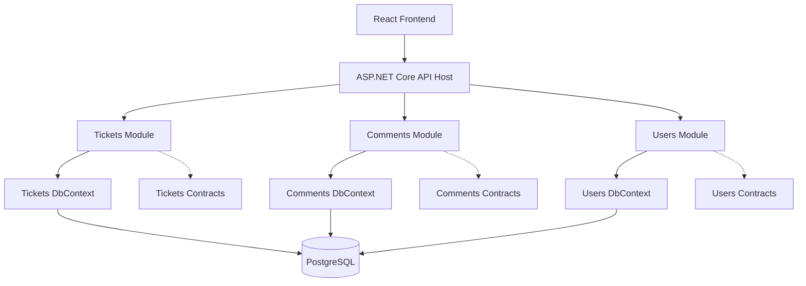

# Nylos Helpdesk

A compact internal issue and ticket tracker built for the Nylos  Software Developer technical assessment.

The application allows team members to create, assign, update, and track support tickets, move tickets through a defined status workflow, and discuss tickets through comments.

> Status: Backend architecture scaffolded. Core features are in progress.

## Tech stack

### Backend

- C# / ASP.NET Core Web API
- .NET 10
- PostgreSQL
- Entity Framework Core
- Npgsql PostgreSQL provider

### Frontend

- React
- TypeScript
- Vite

### Development tooling

- Docker Compose for local PostgreSQL
- Git and GitHub

## Local PostgreSQL

PostgreSQL runs locally through Docker Compose.

### Start the database

```bash
cd backend
cp .env.example .env
docker compose up -d
```

### Check database status

```bash
docker compose ps
```

### Stop the database

```bash
docker compose down
```

### Remove the database and all local data

> Warning: this permanently deletes local PostgreSQL data.

```bash
docker compose down -v
```

## Architecture

The backend follows a pragmatic layered modular monolith architecture.

The application is developed as one ASP.NET Core API, but the code is divided into three business modules:

- Tickets
- Comments
- Users

Each module owns its:

- Domain rules.
- Application use cases.
- Presentation endpoints.
- EF Core `DbContext`.
- PostgreSQL schema.
- Database migrations.

Modules communicate through explicit contracts rather than directly accessing another module's implementation or database context.

```text
React frontend
      ↓
ASP.NET Core API host
      ↓
Tickets | Comments | Users modules
      ↓
PostgreSQL
```

## Backend structure

```text
backend/
├── Nylos.Helpdesk.slnx
├── docker-compose.yml
├── src/
│   ├── Host/
│   │   └── Nylos.Helpdesk.Api/
│   │       ├── Program.cs
│   │       ├── Controllers/
│   │       ├── Middleware/
│   │       └── appsettings.json
│   │
│   ├── Modules/
│   │   ├── Tickets/
│   │   │   ├── Nylos.Helpdesk.Modules.Tickets/
│   │   │   │   ├── Application/
│   │   │   │   ├── Domain/
│   │   │   │   ├── Infrastructure/
│   │   │   │   │   ├── Persistence/
│   │   │   │   │   └── Migrations/
│   │   │   │   ├── Presentation/
│   │   │   │   └── TicketsModule.cs
│   │   │   └── Nylos.Helpdesk.Modules.Tickets.Contracts/
│   │   │
│   │   ├── Comments/
│   │   │   ├── Nylos.Helpdesk.Modules.Comments/
│   │   │   │   ├── Application/
│   │   │   │   ├── Domain/
│   │   │   │   ├── Infrastructure/
│   │   │   │   ├── Presentation/
│   │   │   │   └── CommentsModule.cs
│   │   │   └── Nylos.Helpdesk.Modules.Comments.Contracts/
│   │   │
│   │   └── Users/
│   │       ├── Nylos.Helpdesk.Modules.Users/
│   │       │   ├── Application/
│   │       │   ├── Domain/
│   │       │   ├── Infrastructure/
│   │       │   ├── Presentation/
│   │       │   └── UsersModule.cs
│   │       └── Nylos.Helpdesk.Modules.Users.Contracts/
│   │
│   └── Shared/
│       ├── Nylos.Helpdesk.Shared.Abstractions/
│       └── Nylos.Helpdesk.Shared.Infrastructure/
│
└── tests/
```
### Backend responsibilities

- `Host`: Application startup, dependency injection, middleware, and module registration.
- `Tickets`: Ticket CRUD, assignment, filtering, pagination, and status workflow.
- `Comments`: Ticket comment creation and retrieval.
- `Users`: User management and assignee lookup.
- `Contracts`: Public module interfaces and DTOs used for module-to-module communication.
- `Shared.Abstractions`: Small cross-cutting abstractions.
- `Shared.Infrastructure`: Shared technical services such as error handling and observability.
### Persistence ownership

Each module owns its own EF Core persistence boundary:

- `TicketsDbContext` → `tickets` schema and migrations.
- `CommentsDbContext` → `comments` schema and migrations.
- `UsersDbContext` → `users` schema and migrations.

All contexts connect to the same PostgreSQL database for local development.
## System overview


## 🔍 Detailed Component Breakdown (Part 1: Host & Shared)

### 1. `src/Host/` (The Application Gateway)
The `Host` folder contains the runtime executable project (`Nylos.Helpdesk.Api`).

* **Responsibilities:**
  * Configures the HTTP request pipeline (CORS, Authorization, OpenAPI / Swagger).
  * Reads configuration files (`appsettings.json`, environment variables).
  * Registers Dependency Injection modules using `builder.Services.AddTicketsModule()`, `AddCommentsModule()`, and `AddUsersModule()`.
* **Rules for Host:**
  * **No Controllers:** Controllers belong inside each module's `Presentation/` folder.
  * **No Database Contexts:** Data persistence belongs strictly inside individual modules.
  * **No Business Rules:** Host only orchestrates starting the application and wiring modules together.

---

### 2. `src/Shared/` (The Common Foundation)
The `Shared` folder houses reusable primitives and technical logic needed across all modules.

#### A. `Nylos.Helpdesk.Shared.Abstractions`
* **Purpose:** Provides pure C# interfaces, abstractions, and base building blocks.
* **Key Contents:**
  * **Domain Primitives:** `Entity`, `AggregateRoot<TId>`, `ValueObject`.
  * **Result Pattern:** Standardized return types (`Result`, `Result<T>`, `Error`) to avoid using slow C# exceptions for normal business flows.
  * **Shared Contracts:** Base interfaces like `IClock`, `IUnitOfWork`, and `IDomainEvent`.
* **Dependencies:** Zero heavy external libraries. Keep this project lightweight!

#### B. `Nylos.Helpdesk.Shared.Infrastructure`
* **Purpose:** Holds technical implementations tied to ASP.NET Core and Entity Framework Core.
* **Key Contents:**
  * **Global Exception Handling:** Middleware that catches unhandled exceptions and converts them into standardized JSON (`ProblemDetails`).
  * **Database Interceptors:** Automatic auditing (e.g., updating `CreatedAt` and `UpdatedAt` timestamps when saving changes).
  * **Cross-Cutting Utilities:** Custom logging, HTTP policies, and shared swagger extensions.
---

## 🔍 Detailed Component Breakdown (Part 2: Modules & Communication)

### 3. `src/Modules/` (Business Domain Logic)
Every business capability is placed inside `src/Modules/`. Each module is divided into **two distinct projects**:

#### A. The Main Module (e.g., `Nylos.Helpdesk.Modules.Tickets`)
This is the **private core** of the module. Other modules **cannot** reference this project directly. Internally, it follows a clean, pragmatic 4-layer structure:

1. 📂 **`Domain/`**: The core business heart. Contains entities (`Ticket.cs`), value objects (`TicketPriority.cs`), enums, and domain logic. It has no external dependencies.
2. 📂 **`Application/`**: Use-case orchestration. Implements feature handling using Commands, Queries, and DTOs (e.g., `CreateTicketCommand`, `GetTicketByIdQuery`).
3. 📂 **`Infrastructure/`**: Data persistence and external integrations. Contains the module's private `DbContext`, entity configurations, and repositories.
4. 📂 **`Presentation/`**: HTTP communication. Contains API Controllers or Minimal API Endpoints that receive requests and map them to Application handlers.

#### B. The Contracts Project (e.g., `Nylos.Helpdesk.Modules.Tickets.Contracts`)
This is the **public face** of the module.

* When the `Comments` module needs data from `Tickets`, it **only** references `Nylos.Helpdesk.Modules.Tickets.Contracts`.
* **Key Contents:**
  * **Public Interfaces:** Contract APIs exposed for in-memory module communication (e.g., `ITicketApi`).
  * **Public DTOs:** Data Transfer Objects safe to share across module boundaries (e.g., `TicketSummaryDto`).
  * **Integration Events:** Asynchronous event definitions emitted when significant business state changes occur (e.g., `TicketResolvedIntegrationEvent`).

---

## 🤝 Cross-Module Communication Rules

Modules must never reach into another module's internal database or private files. Communication happens in two controlled ways:

```text
  [ Comments Module ] ──(Calls Interface)──> [ Tickets.Contracts (ITicketApi) ]
                                                            ▲
                                                            │ (Implemented by)
                                            [ Tickets Module (Private) ]


### Modules

- **Tickets**: Ticket creation, editing, assignment, status workflow, filtering, and pagination.
- **Comments**: Adding and retrieving ticket comments.
- **Users**: Listing users available for ticket assignment.

### Layer responsibilities

- **Host/API**: Application startup, dependency injection, middleware, OpenAPI configuration, and module registration.
- **Presentation**: HTTP endpoints and request/response mapping.
- **Application**: Use cases, validation, and orchestration of business operations.
- **Domain**: Entities, value objects, enums, and business rules.
- **Infrastructure**: PostgreSQL persistence, EF Core configuration, migrations, and seed data.
- **Contracts**: The intentional public surface of a module for cross-module communication.

### Dependency rules

- Modules must not directly reference another module's implementation.
- A module may reference another module's `*.Contracts` project when integration is needed.
- Shared projects contain only cross-cutting technical abstractions and infrastructure.
- Business rules belong in the module domain/application layers, never in React components.

## Planned features

- [ ] Ticket CRUD operations.
- [ ] Ticket status workflow: `Open → In Progress → Resolved → Closed`.
- [ ] Server-side validation of invalid status transitions.
- [ ] Ticket assignment to users.
- [ ] Ticket comments.
- [ ] Ticket filtering by status, priority, and assignee.
- [ ] Ticket pagination and sorting.
- [ ] PostgreSQL database integration using EF Core migrations.
- [ ] Sample data seeding.
- [ ] React ticket list, form, and ticket-detail views.
- [ ] Loading, empty, validation, and error states.
- [ ] Automated tests for core ticket workflow rules.

## Getting started

### Prerequisites

Install:

- .NET 10 SDK
- Node.js 20 or newer
- Docker and Docker Compose
- Git

### Clone the repository

```bash
git clone https://github.com/wubshet-kebede/nylos-helpdesk.git
cd nylos-helpdesk
````

### Backend

The backend solution is located in the `backend` directory.

```bash
cd backend
dotnet restore
dotnet build
dotnet run --project src/Host/Nylos.Helpdesk.Api
```

The API will be available at the URL shown in the terminal.

> PostgreSQL, EF Core migrations, and Docker Compose setup will be added as implementation progresses.

## API conventions

The API will use REST-style endpoints:

```text
GET    /api/tickets
GET    /api/tickets/{id}
POST   /api/tickets
PUT    /api/tickets/{id}
DELETE /api/tickets/{id}

GET    /api/tickets/{ticketId}/comments
POST   /api/tickets/{ticketId}/comments

GET    /api/users
```

Expected error responses will use a consistent `ProblemDetails`-style response shape.

## Key design decisions

- **Single deployable application**: A modular monolith avoids the deployment, networking, and operational overhead of microservices for a small internal helpdesk application.
- **Module boundaries**: Tickets, Comments, and Users are separated because they represent distinct responsibilities.
- **Contract-based integration**: Modules expose only deliberate public contracts, not their internal implementation details.
- **Domain-owned workflow rules**: Ticket status transitions are validated server-side to ensure the rule cannot be bypassed by the frontend.
- **EF Core migrations**: Database schema changes will be versioned, reproducible, and committed to the repository.
- **PostgreSQL in Docker**: Docker Compose will provide an easy and consistent local database setup.

## Trade-offs

The project uses module boundaries and layered separation to keep the code maintainable. However, it intentionally remains a single application and database because the problem scope is small and time-boxed.

I intentionally do not use microservices, a distributed message broker, separate databases per module, or complex event-driven infrastructure. Those approaches would introduce operational overhead without solving a demonstrated requirement for this assessment.

## Development progress

- [x] Create backend solution.
- [x] Create modular monolith project structure.
- [x] Add API host, module projects, contracts, and shared projects.
- [ ] Configure PostgreSQL and EF Core.
- [ ] Create database migrations.
- [ ] Implement tickets module.
- [ ] Implement comments module.
- [ ] Implement users module.
- [ ] Build React frontend.
- [ ] Add tests.
- [ ] Complete API documentation.
## Getting started

### Prerequisites

- .NET 10 SDK
- Node.js 20+
- Docker and Docker Compose
- Git

### Clone the repository

```bash
git clone https://github.com/<your-username>/nylos-helpdesk.git
cd nylos-helpdesk
```

### Start PostgreSQL

```bash
cd backend
cp .env.example .env
docker compose up -d
```

### Apply database migrations

```bash
dotnet ef database update \
  --project src/Modules/Users/Nylos.Helpdesk.Modules.Users \
  --startup-project src/Host/Nylos.Helpdesk.Api \
  --context UsersDbContext

dotnet ef database update \
  --project src/Modules/Tickets/Nylos.Helpdesk.Modules.Tickets \
  --startup-project src/Host/Nylos.Helpdesk.Api \
  --context TicketsDbContext

dotnet ef database update \
  --project src/Modules/Comments/Nylos.Helpdesk.Modules.Comments \
  --startup-project src/Host/Nylos.Helpdesk.Api \
  --context CommentsDbContext
```

### Start the backend

```bash
dotnet run --project src/Host/Nylos.Helpdesk.Api
```

### Start the frontend

Open another terminal:

```bash
cd frontend
npm install
npm run dev
```
## Environment variables

### Backend

Create:

```text
backend/src/Host/Nylos.Helpdesk.Api/.env
```

```env
ConnectionStrings__Postgres=Host=localhost;Port=5432;Database=nylos_helpdesk;Username=nylos;Password=change_me
```

### Frontend

Create:

```text
frontend/.env
```

```env
VITE_API_BASE_URL=http://localhost:5000
```
## Features

- Create, view, update, and delete tickets.
- Assign tickets to users.
- Filter tickets by status, priority, and assignee.
- Sort and paginate tickets.
- Move tickets through the status workflow:
  `Open → In Progress → Resolved → Closed`.
- Reject invalid status transitions server-side.
- Add and view ticket comments.
- Validate ticket and comment input.
- Return consistent API error responses.
- Seed sample users and tickets.
- Handle loading, empty, validation, and error states in the frontend.

## Design decisions and trade-offs

### Modular monolith

The backend is a modular monolith rather than a microservices system. Tickets, Comments, and Users have explicit internal boundaries, but they run in one ASP.NET Core host. This keeps deployment and local development simple while preserving a structure that can evolve as the application grows.

### Separate DbContext per module

Each module owns its EF Core `DbContext`, migrations, and PostgreSQL schema. Cross-module relationships are represented by IDs and validated through module contracts rather than direct access to another module's database context.

### Server-side workflow validation

Ticket status transitions are enforced in the backend domain logic instead of relying on the React frontend. This prevents clients from bypassing the workflow rules.


### Single PostgreSQL database

All module contexts connect to one PostgreSQL database for simpler local development. The modules still own separate schemas and migrations. Separate databases could be introduced later if independent scaling or deployment becomes necessary.

## License

This repository was created for the Nylos Junior Software Developer technical assessment.
