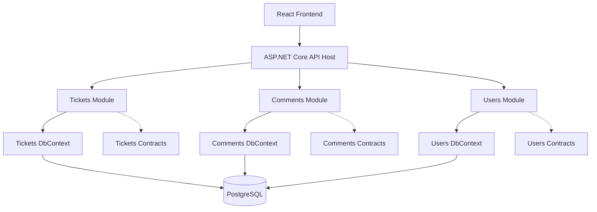

# Nylos Helpdesk

A modern internal helpdesk and issue-tracking platform for creating, assigning,
tracking, and resolving support tickets through a structured workflow.

Built as a technical assessment project with a focus on clean architecture,
modular boundaries, server-side business rules, and a responsive React
dashboard.

## Tech stack

### Backend

- C# / ASP.NET Core Web API
- .NET 10
- PostgreSQL
- Entity Framework Core
- Npgsql PostgreSQL provider

### Frontend

- React
- TypeScript
- Vite

### Development tooling

- Docker Compose for local PostgreSQL
- Git and GitHub

## Local PostgreSQL

PostgreSQL runs locally through Docker Compose.

### Start the database

```bash
cd backend
cp .env.example .env
docker compose up -d
```

### Check database status

```bash
docker compose ps
```

### Stop the database

```bash
docker compose down
```

### Remove the database and all local data

> Warning: this permanently deletes local PostgreSQL data.

```bash
docker compose down -v
```

## Architecture

The backend follows a pragmatic layered modular monolith architecture.

The application is developed as one ASP.NET Core API, but the code is divided into three business modules:

- Tickets
- Comments
- Users

Each module owns its:

- Domain rules.
- Application use cases.
- Presentation endpoints.
- EF Core `DbContext`.
- PostgreSQL schema.
- Database migrations.

Modules communicate through explicit contracts rather than directly accessing another module's implementation or database context.

```text
React frontend
      ↓
ASP.NET Core API host
      ↓
Tickets | Comments | Users modules
      ↓
PostgreSQL
```

## Backend structure

```text
backend/
├── Nylos.Helpdesk.slnx
├── docker-compose.yml
├── src/
│   ├── Host/
│   │   └── Nylos.Helpdesk.Api/
│   │       ├── Program.cs
│   │       ├── Controllers/
│   │       ├── Middleware/
│   │       └── appsettings.json
│   │
│   ├── Modules/
│   │   ├── Tickets/
│   │   │   ├── Nylos.Helpdesk.Modules.Tickets/
│   │   │   │   ├── Application/
│   │   │   │   ├── Domain/
│   │   │   │   ├── Infrastructure/
│   │   │   │   │   ├── Persistence/
│   │   │   │   │   └── Migrations/
│   │   │   │   ├── Presentation/
│   │   │   │   └── TicketsModule.cs
│   │   │   └── Nylos.Helpdesk.Modules.Tickets.Contracts/
│   │   │
│   │   ├── Comments/
│   │   │   ├── Nylos.Helpdesk.Modules.Comments/
│   │   │   │   ├── Application/
│   │   │   │   ├── Domain/
│   │   │   │   ├── Infrastructure/
│   │   │   │   ├── Presentation/
│   │   │   │   └── CommentsModule.cs
│   │   │   └── Nylos.Helpdesk.Modules.Comments.Contracts/
│   │   │
│   │   └── Users/
│   │       ├── Nylos.Helpdesk.Modules.Users/
│   │       │   ├── Application/
│   │       │   ├── Domain/
│   │       │   ├── Infrastructure/
│   │       │   ├── Presentation/
│   │       │   └── UsersModule.cs
│   │       └── Nylos.Helpdesk.Modules.Users.Contracts/
│   │
│   └── Shared/
│       ├── Nylos.Helpdesk.Shared.Abstractions/
│       └── Nylos.Helpdesk.Shared.Infrastructure/
│
└── tests/
```
### Backend responsibilities

- `Host`: Application startup, dependency injection, middleware, and module registration.
- `Tickets`: Ticket CRUD, assignment, filtering, pagination, and status workflow.
- `Comments`: Ticket comment creation and retrieval.
- `Users`: User management and assignee lookup.
- `Contracts`: Public module interfaces and DTOs used for module-to-module communication.
- `Shared.Abstractions`: Small cross-cutting abstractions.
- `Shared.Infrastructure`: Shared technical services such as error handling and observability.

### Module communication rules

Modules are isolated by default.

- A module must not reference another module's implementation project.
- A module may reference another module's `*.Contracts` project when it needs a public interface or shared DTO.
- A module must not access another module's `DbContext` or database tables directly.
- Cross-module references use IDs, such as `AssigneeId`, `TicketId`, and `AuthorId`, rather than EF navigation properties across module boundaries.
- Ticket workflow rules are enforced on the server, not only in the React UI.

### Persistence ownership

Each module owns its own EF Core persistence boundary:

- `TicketsDbContext` → `tickets` schema and migrations.
- `CommentsDbContext` → `comments` schema and migrations.
- `UsersDbContext` → `users` schema and migrations.

All contexts connect to the same PostgreSQL database for local development.
## System overview



## Getting started

### Prerequisites

Install:

- .NET 10 SDK
- Node.js 20 or newer
- Docker and Docker Compose
- Git

### Clone the repository

```bash
git clone https://github.com/wubshet-kebede/nylos-helpdesk.git
cd nylos-helpdesk
````
### Prerequisites

- .NET 10 SDK
- Node.js 20+
- Docker and Docker Compose
- Git

### Clone the repository

```bash
git clone https://github.com/<your-username>/nylos-helpdesk.git
cd nylos-helpdesk
```

### Start PostgreSQL

```bash
cd backend
cp .env.example .env
docker compose up -d
```

### Apply database migrations

```bash
dotnet ef database update \
  --project src/Modules/Users/Nylos.Helpdesk.Modules.Users \
  --startup-project src/Host/Nylos.Helpdesk.Api \
  --context UsersDbContext

dotnet ef database update \
  --project src/Modules/Tickets/Nylos.Helpdesk.Modules.Tickets \
  --startup-project src/Host/Nylos.Helpdesk.Api \
  --context TicketsDbContext

dotnet ef database update \
  --project src/Modules/Comments/Nylos.Helpdesk.Modules.Comments \
  --startup-project src/Host/Nylos.Helpdesk.Api \
  --context CommentsDbContext
```

### Start the backend

```bash
dotnet run --project src/Host/Nylos.Helpdesk.Api
```

### Start the frontend

Open another terminal:

```bash
cd frontend
npm install
npm run dev
```
## Environment variables

### Backend

Create:

```text
backend/src/Host/Nylos.Helpdesk.Api/.env
```

```env
ConnectionStrings__Postgres=Host=localhost;Port=5432;Database=nylos_helpdesk;Username=nylos;Password=change_me
```

### Frontend

Create:

```text
frontend/.env
```

```env
VITE_API_BASE_URL=http://localhost:5000
```
## Features

- Create, view, update, and delete tickets.
- Assign tickets to users.
- Filter tickets by status, priority, and assignee.
- Sort and paginate tickets.
- Move tickets through the status workflow:
  `Open → In Progress → Resolved → Closed`.
- Reject invalid status transitions server-side.
- Add and view ticket comments.
- Validate ticket and comment input.
- Return consistent API error responses.
- Seed sample users and tickets.
- Handle loading, empty, validation, and error states in the frontend.

## Design decisions and trade-offs

### Modular monolith

The backend is a modular monolith rather than a microservices system. Tickets, Comments, and Users have explicit internal boundaries, but they run in one ASP.NET Core host. This keeps deployment and local development simple while preserving a structure that can evolve as the application grows.

### Separate DbContext per module

Each module owns its EF Core `DbContext`, migrations, and PostgreSQL schema. Cross-module relationships are represented by IDs and validated through module contracts rather than direct access to another module's database context.

### Server-side workflow validation

Ticket status transitions are enforced in the backend domain logic instead of relying on the React frontend. This prevents clients from bypassing the workflow rules.


### Single PostgreSQL database

All module contexts connect to one PostgreSQL database for simpler local development. The modules still own separate schemas and migrations. Separate databases could be introduced later if independent scaling or deployment becomes necessary.

## License

This repository was created for the Nylos Junior Software Developer technical assessment.
